# Multi-Agent Orchestration Design

## Overview

The Multi-Agent Orchestration system provides intelligent coordination between specialized banking agents, enabling complex financial workflows while maintaining security, compliance, and performance standards. The system is built around a central Supervisor/Orchestrator that manages agent interactions, memory systems, and decision-making processes.

## 1. Supervisor/Orchestrator Agent

### 1.1 Core Architecture

#### Supervisor Agent Components

```mermaid
graph TB
    subgraph "Supervisor Agent"
        subgraph "Intent Analysis Engine"
            NLU[Natural Language Understanding]
            BANKING_CLASS[Banking Domain Classification]
            MULTI_INTENT[Multi-intent Detection]
            CONTEXT_INTERP[Context-aware Interpretation]
        end

        subgraph "Workflow Manager"
            PROCESS_ORCH[Multi-step Process Orchestration]
            STATE_MGR[State Management]
            ERROR_RECOVERY[Error Handling and Recovery]
            PARALLEL_COORD[Parallel Task Coordination]
        end

        subgraph "Context Manager"
            SESSION_MAINT[Session Context Maintenance]
            CROSS_AGENT[Cross-agent Context Sharing]
            MEMORY_INTEG[Memory System Integration]
            CONTEXT_OPT[Context Compression and Optimization]
        end

        subgraph "Response Aggregator"
            RESPONSE_SYNTH[Multi-agent Response Synthesis]
            CONFLICT_RES[Conflict Resolution]
            RESPONSE_PRIOR[Response Prioritization]
            QUALITY_ASSUR[Quality Assurance]
        end

        subgraph "Quality Controller"
            RESPONSE_VAL[Response Validation]
            COMPLIANCE_CHECK[Compliance Checking]
            RISK_ASSESS[Risk Assessment]
            PERF_MONITOR[Performance Monitoring]
        end
    end

    NLU --> BANKING_CLASS
    BANKING_CLASS --> MULTI_INTENT
    MULTI_INTENT --> CONTEXT_INTERP
    PROCESS_ORCH --> STATE_MGR
    STATE_MGR --> ERROR_RECOVERY
    ERROR_RECOVERY --> PARALLEL_COORD
    SESSION_MAINT --> CROSS_AGENT
    CROSS_AGENT --> MEMORY_INTEG
    MEMORY_INTEG --> CONTEXT_OPT
    RESPONSE_SYNTH --> CONFLICT_RES
    CONFLICT_RES --> RESPONSE_PRIOR
    RESPONSE_PRIOR --> QUALITY_ASSUR
    RESPONSE_VAL --> COMPLIANCE_CHECK
    COMPLIANCE_CHECK --> RISK_ASSESS
    RISK_ASSESS --> PERF_MONITOR
```


### 1.2 Intent Analysis Engine

#### Banking Intent Classification

```mermaid
graph TB
    subgraph "Intent Categories"
        subgraph "Account Management"
            BALANCE_INQ[Balance Inquiries]
            TRANSACTION_HIST[Transaction History]
            ACCOUNT_MOD[Account Modifications]
            SERVICE_REQ[Service Requests]
        end

        subgraph "Lending Operations"
            LOAN_APP[Loan Applications]
            CREDIT_ASSESS[Credit Assessments]
            PAYMENT_PROC[Payment Processing]
            REFINANCE[Refinancing Requests]
        end

        subgraph "Investment Services"
            PORTFOLIO_MGR[Portfolio Management]
            INVESTMENT_ADV[Investment Advice]
            RISK_ASSESS[Risk Assessment]
            PERF_ANALYSIS[Performance Analysis]
        end

        subgraph "Customer Service"
            GENERAL_INQ[General Inquiries]
            COMPLAINT_RES[Complaint Resolution]
            PRODUCT_INFO[Product Information]
            TECH_SUPPORT[Technical Support]
        end

        subgraph "Compliance & Risk"
            REGULATORY_INQ[Regulatory Inquiries]
            RISK_ASSESSMENTS[Risk Assessments]
            AUDIT_REQ[Audit Requests]
            FRAUD_DETECT[Fraud Detection]
        end
    end

    BALANCE_INQ --> TRANSACTION_HIST
    TRANSACTION_HIST --> ACCOUNT_MOD
    ACCOUNT_MOD --> SERVICE_REQ
    LOAN_APP --> CREDIT_ASSESS
    CREDIT_ASSESS --> PAYMENT_PROC
    PAYMENT_PROC --> REFINANCE
    PORTFOLIO_MGR --> INVESTMENT_ADV
    INVESTMENT_ADV --> RISK_ASSESS
    RISK_ASSESS --> PERF_ANALYSIS
    GENERAL_INQ --> COMPLAINT_RES
    COMPLAINT_RES --> PRODUCT_INFO
    PRODUCT_INFO --> TECH_SUPPORT
    REGULATORY_INQ --> RISK_ASSESSMENTS
    RISK_ASSESSMENTS --> AUDIT_REQ
    AUDIT_REQ --> FRAUD_DETECT
```


#### Intent Processing Pipeline
```
Processing Steps:
1. Input Preprocessing
   ├── Text normalization
   ├── Entity extraction
   ├── Context enrichment
   └── Language detection

2. Intent Classification
   ├── Multi-label classification
   ├── Confidence scoring
   ├── Ambiguity detection
   └── Fallback handling

3. Entity Resolution
   ├── Customer identification
   ├── Account resolution
   ├── Product identification
   └── Temporal entity extraction

4. Context Integration
   ├── Historical context
   ├── Session context
   ├── User profile integration
   └── Business context
```

### 1.3 Workflow Manager

#### Workflow Types
```
Banking Workflows:
├── Simple Workflows (Single Agent)
│   ├── Balance inquiry
│   ├── Transaction lookup
│   ├── Basic customer service
│   └── Information retrieval
├── Complex Workflows (Multi-Agent)
│   ├── Loan application processing
│   ├── Investment portfolio analysis
│   ├── Risk assessment procedures
│   └── Compliance verification
├── Approval Workflows
│   ├── Credit limit increases
│   ├── Large transaction approvals
│   ├── Policy exceptions
│   └── Regulatory submissions
└── Emergency Workflows
    ├── Fraud detection response
    ├── Security incident handling
    ├── System failure recovery
    └── Regulatory emergency response
```

#### Workflow Orchestration
```
Orchestration Features:
├── State Management
│   ├── Workflow state persistence
│   ├── Checkpoint creation
│   ├── Recovery mechanisms
│   └── State synchronization
├── Task Coordination
│   ├── Sequential task execution
│   ├── Parallel task processing
│   ├── Conditional branching
│   └── Loop handling
├── Error Handling
│   ├── Retry mechanisms
│   ├── Fallback strategies
│   ├── Error escalation
│   └── Graceful degradation
└── Performance Optimization
    ├── Task prioritization
    ├── Resource allocation
    ├── Load balancing
    └── Caching strategies
```

## 2. Specialized Banking Agents

### 2.1 Agent Architecture

#### Base Agent Framework
```
Base Agent Components:
├── Agent Core
│   ├── Agent identity and capabilities
│   ├── Communication interface
│   ├── State management
│   └── Health monitoring
├── Task Processor
│   ├── Task queue management
│   ├── Request processing
│   ├── Response generation
│   └── Error handling
├── Domain Logic
│   ├── Business rule implementation
│   ├── Domain-specific algorithms
│   ├── Validation logic
│   └── Calculation engines
├── Integration Layer
│   ├── MCP client implementation
│   ├── API connectors
│   ├── Data transformation
│   └── Protocol handling
└── Monitoring & Logging
    ├── Performance metrics
    ├── Audit logging
    ├── Error tracking
    └── Usage analytics
```

### 2.2 CRM Agent

#### Capabilities
```
CRM Agent Functions:
├── Customer Management
│   ├── Profile retrieval and updates
│   ├── Relationship analysis
│   ├── Segmentation and targeting
│   └── Lifecycle management
├── Interaction Management
│   ├── Communication history
│   ├── Preference management
│   ├── Channel optimization
│   └── Satisfaction tracking
├── Sales Support
│   ├── Cross-selling opportunities
│   ├── Up-selling recommendations
│   ├── Lead qualification
│   └── Campaign management
└── Service Excellence
    ├── Service request handling
    ├── Issue resolution
    ├── Escalation management
    └── Quality assurance
```

#### Decision Logic
```
CRM Decision Framework:
├── Customer Segmentation
│   ├── Demographic analysis
│   ├── Behavioral patterns
│   ├── Value-based segmentation
│   └── Risk profiling
├── Recommendation Engine
│   ├── Product affinity modeling
│   ├── Next best action
│   ├── Timing optimization
│   └── Channel selection
├── Relationship Scoring
│   ├── Engagement metrics
│   ├── Satisfaction scores
│   ├── Loyalty indicators
│   └── Churn prediction
└── Service Optimization
    ├── Response time optimization
    ├── Quality scoring
    ├── Resource allocation
    └── Escalation triggers
```

### 2.3 Lending Agent

#### Core Functions
```
Lending Agent Capabilities:
├── Application Processing
│   ├── Application intake
│   ├── Document verification
│   ├── Completeness checking
│   └── Initial screening
├── Credit Assessment
│   ├── Credit score analysis
│   ├── Income verification
│   ├── Debt-to-income calculation
│   └── Risk evaluation
├── Underwriting Support
│   ├── Policy compliance checking
│   ├── Exception handling
│   ├── Decision recommendations
│   └── Documentation requirements
└── Portfolio Management
    ├── Loan monitoring
    ├── Performance tracking
    ├── Risk assessment
    └── Collection support
```

#### Risk Assessment Logic
```
Risk Assessment Framework:
├── Credit Risk Evaluation
│   ├── Credit history analysis
│   ├── Payment behavior patterns
│   ├── Current obligations
│   └── Future capacity assessment
├── Collateral Assessment
│   ├── Asset valuation
│   ├── Marketability analysis
│   ├── Legal verification
│   └── Insurance requirements
├── Market Risk Analysis
│   ├── Interest rate sensitivity
│   ├── Economic indicators
│   ├── Industry trends
│   └── Geographic factors
└── Operational Risk
    ├── Process compliance
    ├── Documentation quality
    ├── System reliability
    └── Human error factors
```

### 2.4 Credit Agent

#### Primary Functions
```
Credit Agent Capabilities:
├── Credit Scoring
│   ├── FICO score integration
│   ├── Alternative scoring models
│   ├── Real-time score updates
│   └── Score factor analysis
├── Risk Management
│   ├── Credit limit management
│   ├── Exposure monitoring
│   ├── Portfolio risk assessment
│   └── Stress testing
├── Fraud Detection
│   ├── Transaction monitoring
│   ├── Pattern analysis
│   ├── Anomaly detection
│   └── Alert generation
└── Compliance Monitoring
    ├── Regulatory compliance
    ├── Policy adherence
    ├── Audit trail maintenance
    └── Reporting requirements
```

### 2.5 Analytics Agent

#### Analytical Capabilities
```
Analytics Agent Functions:
├── Financial Analysis
│   ├── Performance metrics calculation
│   ├── Trend analysis
│   ├── Comparative analysis
│   └── Forecasting models
├── Customer Analytics
│   ├── Behavior analysis
│   ├── Segmentation analytics
│   ├── Lifetime value calculation
│   └── Churn prediction
├── Risk Analytics
│   ├── Portfolio risk assessment
│   ├── Stress testing
│   ├── Scenario analysis
│   └── Regulatory capital calculation
└── Business Intelligence
    ├── Dashboard generation
    ├── Report automation
    ├── KPI monitoring
    └── Executive summaries
```

### 2.6 Compliance Agent

#### Compliance Functions
```
Compliance Agent Capabilities:
├── Regulatory Monitoring
│   ├── Regulation tracking
│   ├── Policy updates
│   ├── Compliance checking
│   └── Violation detection
├── Audit Support
│   ├── Audit trail generation
│   ├── Evidence collection
│   ├── Report preparation
│   └── Remediation tracking
├── Risk Assessment
│   ├── Compliance risk evaluation
│   ├── Control effectiveness
│   ├── Gap analysis
│   └── Mitigation strategies
└── Training & Awareness
    ├── Training content delivery
    ├── Awareness campaigns
    ├── Knowledge testing
    └── Certification tracking
```

## 3. Agent Coordination System

### 3.1 Task Queue Management

#### Queue Architecture
```
Task Queue Components:
├── Priority Queue
│   ├── High priority (regulatory, fraud)
│   ├── Medium priority (customer service)
│   ├── Low priority (analytics, reporting)
│   └── Background tasks (maintenance)
├── Agent-Specific Queues
│   ├── CRM task queue
│   ├── Lending task queue
│   ├── Credit task queue
│   └── Analytics task queue
├── Shared Queue
│   ├── Multi-agent tasks
│   ├── Coordination tasks
│   ├── Escalation tasks
│   └── System tasks
└── Dead Letter Queue
    ├── Failed tasks
    ├── Timeout tasks
    ├── Error tasks
    └── Retry exhausted tasks
```

#### Queue Management Policies
```
Queue Policies:
├── Priority Management
│   ├── Dynamic priority adjustment
│   ├── SLA-based prioritization
│   ├── Business rule priorities
│   └── Emergency escalation
├── Load Balancing
│   ├── Round-robin distribution
│   ├── Weighted distribution
│   ├── Capacity-based routing
│   └── Performance-based routing
├── Retry Policies
│   ├── Exponential backoff
│   ├── Maximum retry limits
│   ├── Circuit breaker integration
│   └── Fallback mechanisms
└── Monitoring & Alerting
    ├── Queue depth monitoring
    ├── Processing time tracking
    ├── Error rate monitoring
    └── SLA violation alerts
```

### 3.2 Agent Registry

#### Registry Components
```
Agent Registry Features:
├── Service Discovery
│   ├── Agent registration
│   ├── Capability advertisement
│   ├── Health status tracking
│   └── Version management
├── Load Balancing
│   ├── Agent capacity tracking
│   ├── Performance metrics
│   ├── Availability monitoring
│   └── Routing decisions
├── Configuration Management
│   ├── Agent configurations
│   ├── Routing rules
│   ├── Policy settings
│   └── Feature flags
└── Lifecycle Management
    ├── Agent deployment
    ├── Scaling decisions
    ├── Retirement procedures
    └── Migration support
```

### 3.3 Health Monitoring

#### Monitoring Framework
```
Health Monitoring:
├── Agent Health Checks
│   ├── Heartbeat monitoring
│   ├── Response time tracking
│   ├── Error rate monitoring
│   └── Resource utilization
├── System Health Metrics
│   ├── Overall system performance
│   ├── Queue health
│   ├── Memory system status
│   └── Integration health
├── Business Health Indicators
│   ├── SLA compliance
│   ├── Customer satisfaction
│   ├── Business KPIs
│   └── Regulatory compliance
└── Predictive Health Analytics
    ├── Performance trend analysis
    ├── Capacity planning
    ├── Failure prediction
    └── Optimization recommendations
```

## 4. Decision Support System

### 4.1 Decision Engine

#### Decision Framework
```
Decision Engine Components:
├── Rule-Based Decisions
│   ├── Business rule evaluation
│   ├── Policy compliance checking
│   ├── Regulatory requirement validation
│   └── Exception handling
├── Model-Based Decisions
│   ├── Machine learning models
│   ├── Statistical models
│   ├── Risk models
│   └── Predictive models
├── Hybrid Decisions
│   ├── Rule-model combination
│   ├── Ensemble methods
│   ├── Weighted scoring
│   └── Confidence-based selection
└── Human-in-the-Loop
    ├── Escalation triggers
    ├── Expert consultation
    ├── Manual override
    └── Approval workflows
```

### 4.2 Business Rule Engine

#### Rule Categories
```
Business Rules:
├── Regulatory Rules
│   ├── KYC/AML requirements
│   ├── Capital adequacy rules
│   ├── Reporting requirements
│   └── Consumer protection rules
├── Risk Management Rules
│   ├── Credit risk limits
│   ├── Market risk limits
│   ├── Operational risk controls
│   └── Concentration limits
├── Business Policy Rules
│   ├── Product eligibility
│   ├── Pricing rules
│   ├── Service level agreements
│   └── Approval authorities
└── Operational Rules
    ├── Process workflows
    ├── Data validation rules
    ├── System integration rules
    └── Performance standards
```

### 4.3 Machine Learning Models

#### Model Types
```
ML Model Categories:
├── Predictive Models
│   ├── Credit scoring models
│   ├── Fraud detection models
│   ├── Churn prediction models
│   └── Market prediction models
├── Classification Models
│   ├── Customer segmentation
│   ├── Risk classification
│   ├── Product recommendation
│   └── Intent classification
├── Optimization Models
│   ├── Portfolio optimization
│   ├── Resource allocation
│   ├── Pricing optimization
│   └── Process optimization
└── Anomaly Detection Models
    ├── Transaction anomalies
    ├── Behavior anomalies
    ├── System anomalies
    └── Market anomalies
```

## 5. Communication Protocols

### 5.1 Inter-Agent Communication

#### Communication Patterns
```
Communication Protocols:
├── Request-Response
│   ├── Synchronous calls
│   ├── Timeout handling
│   ├── Error propagation
│   └── Response validation
├── Publish-Subscribe
│   ├── Event broadcasting
│   ├── Topic-based routing
│   ├── Asynchronous processing
│   └── Event ordering
├── Message Queuing
│   ├── Reliable delivery
│   ├── Message persistence
│   ├── Dead letter handling
│   └── Priority processing
└── Streaming
    ├── Real-time data streams
    ├── Event streams
    ├── Continuous processing
    └── Backpressure handling
```

### 5.2 Message Formats

#### Standard Message Structure
```json
{
  "messageId": "uuid",
  "timestamp": "ISO8601",
  "source": "agent_id",
  "destination": "agent_id",
  "messageType": "request|response|event|notification",
  "priority": "high|medium|low",
  "correlationId": "uuid",
  "sessionId": "uuid",
  "userId": "user_id",
  "payload": {
    "action": "action_name",
    "parameters": {},
    "context": {},
    "metadata": {}
  },
  "security": {
    "signature": "digital_signature",
    "encryption": "encryption_info",
    "authorization": "auth_token"
  }
}
```

## 6. Performance and Scalability

### 6.1 Performance Optimization

#### Optimization Strategies
```
Performance Features:
├── Caching
│   ├── Response caching
│   ├── Context caching
│   ├── Model caching
│   └── Configuration caching
├── Parallel Processing
│   ├── Multi-agent parallelism
│   ├── Task parallelism
│   ├── Data parallelism
│   └── Pipeline parallelism
├── Resource Management
│   ├── Connection pooling
│   ├── Thread pooling
│   ├── Memory management
│   └── CPU optimization
└── Load Balancing
    ├── Agent load balancing
    ├── Request distribution
    ├── Geographic distribution
    └── Capacity-based routing
```

### 6.2 Scalability Design

#### Scaling Strategies
```
Scalability Features:
├── Horizontal Scaling
│   ├── Agent replication
│   ├── Stateless design
│   ├── Auto-scaling
│   └── Container orchestration
├── Vertical Scaling
│   ├── Resource allocation
│   ├── Performance tuning
│   ├── Capacity optimization
│   └── Hardware upgrades
├── Geographic Scaling
│   ├── Multi-region deployment
│   ├── Data locality
│   ├── Latency optimization
│   └── Disaster recovery
└── Functional Scaling
    ├── Microservices architecture
    ├── Domain separation
    ├── Independent deployment
    └── Technology diversity
```

This multi-agent orchestration design provides a robust foundation for coordinating complex banking operations while maintaining high performance, security, and compliance standards.
