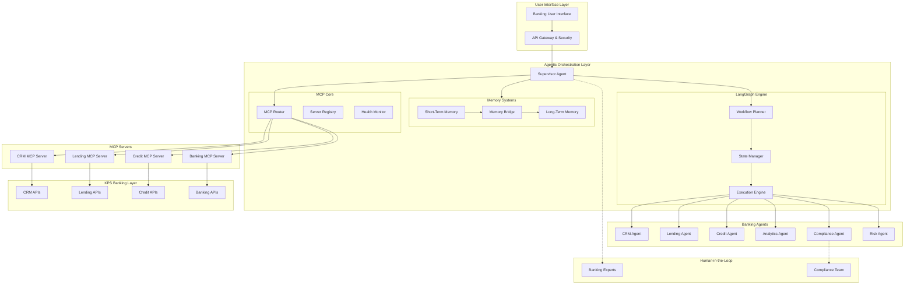
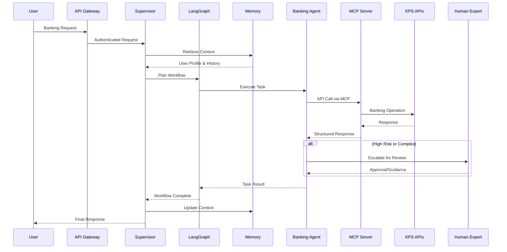
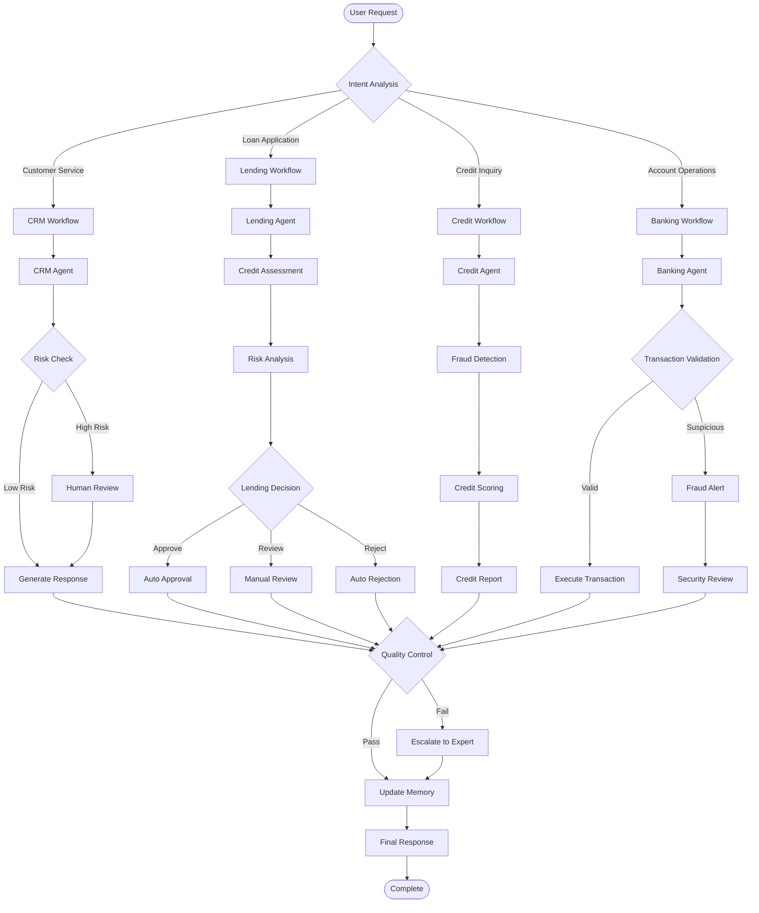
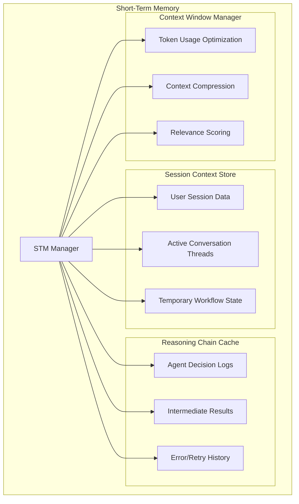
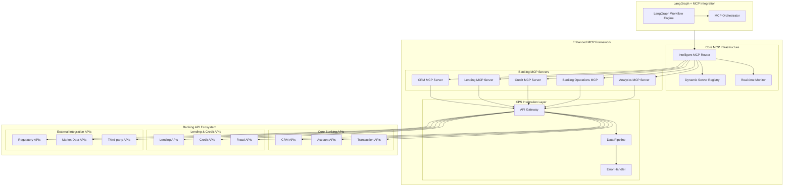
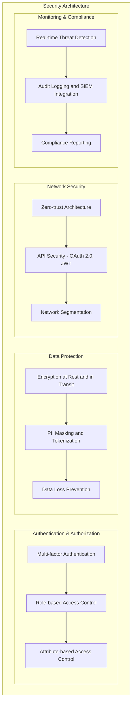
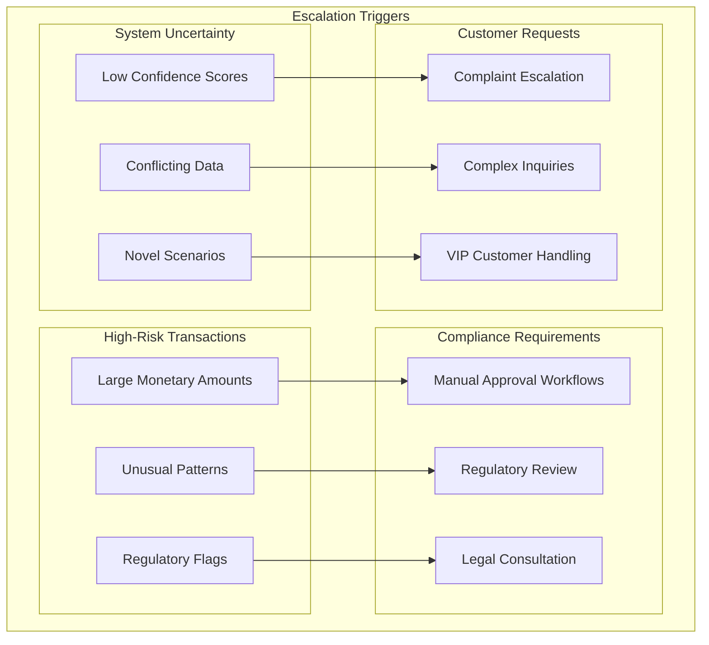

# Enterprise Banking Agentic Layer - Architecture Design

## Executive Summary

This document outlines the architecture for an enterprise-ready agentic orchestration system designed for banking environments, featuring robust memory systems, MCP-based API integrations, and comprehensive compliance capabilities.

## 1. Architectural Principles

### 1.1 Core Design Principles
- **Modularity**: Clear separation of concerns with pluggable components
- **Security-First**: Built-in compliance, audit trails, and data protection
- **Scalability**: Horizontal scaling with stateless agents and persistent memory
- **Extensibility**: MCP-based integration framework for easy API additions
- **Reliability**: Fault tolerance, circuit breakers, and graceful degradation

### 1.2 Banking-Specific Requirements
- **Regulatory Compliance**: SOX, Basel III, GDPR, PCI DSS compliance
- **Audit Trail**: Complete transaction and decision logging
- **Data Sovereignty**: Controlled data flow and residency
- **Risk Management**: Built-in risk assessment and escalation
- **Performance**: Sub-second response times for critical operations

## 2. High-Level Architecture

### 2.1 Enterprise Banking Agentic Architecture



### 2.2 Enhanced Architecture Components

#### 2.2.1 Agentic Orchestration Layer Deep Dive

**LangGraph Workflow Engine**
- **Workflow Planner**: Analyzes complex banking workflows and creates execution plans
- **State Manager**: Maintains workflow state across multiple agents and interactions
- **Execution Engine**: Orchestrates agent execution with conditional logic and error handling

**Supervisor Agent Enhanced Capabilities**
- **Intent Analysis**: Advanced NLU for banking domain with context awareness
- **Multi-Agent Orchestration**: Intelligent task delegation and coordination
- **Quality Control**: Response validation, compliance checking, and risk assessment

**MCP Protocol Core Integration**
- **MCP Router**: Intelligent routing to appropriate banking MCP servers
- **Server Registry**: Dynamic discovery and health monitoring of MCP servers
- **Health Monitor**: Real-time monitoring and circuit breaker patterns

#### 2.2.2 Enhanced Request Flow


#### 2.2.3 Memory System Integration
- **STM**: Real-time session context, active LangGraph workflows, agent reasoning chains
- **LTM**: Persistent user profiles, banking knowledge base, regulatory compliance logs
- **Memory Bridge**: Intelligent context retrieval, workflow state persistence, knowledge extraction

#### 2.2.4 Human-in-the-Loop Integration
- **Automatic Escalation**: Risk-based triggers for human intervention
- **Expert Collaboration**: Seamless handoff between AI agents and human experts
- **Knowledge Capture**: Learning from human decisions to improve agent performance

## 3. Core Components

### 3.1 LangGraph Banking Workflow Engine

The LangGraph integration enables sophisticated workflow orchestration for complex banking operations:



### 3.2 Supervisor/Orchestrator Agent Enhanced
**Core Responsibilities:**
- **Intent Interpretation**: Advanced NLU with banking domain expertise
- **LangGraph Orchestration**: Complex workflow management with conditional logic
- **Agent Coordination**: Intelligent task delegation and parallel processing
- **Memory Management**: STM/LTM bridging with context optimization
- **Quality Assurance**: Response validation, compliance checking, and risk assessment
- **Human Integration**: Seamless escalation and expert collaboration

**Enhanced Features:**
- **Multi-Modal Understanding**: Text, voice, and document processing
- **Contextual Workflows**: Dynamic workflow adaptation based on user context
- **Risk-Aware Orchestration**: Real-time risk assessment and mitigation
- **Compliance Integration**: Automated regulatory compliance checking

### 3.2 Memory Systems Architecture

#### 3.2.1 Short-Term Memory (STM)


#### 3.2.2 Long-Term Memory (LTM)


### 3.3 Specialized Banking Agents

#### 3.3.1 CRM Agent
- Customer data retrieval and analysis
- Relationship management insights
- Customer journey optimization
- Cross-selling/up-selling recommendations

#### 3.3.2 Lending Agent
- Loan application processing
- Credit risk assessment
- Underwriting support
- Portfolio analysis

#### 3.3.3 Credit Agent
- Credit scoring and analysis
- Risk assessment
- Limit management
- Fraud detection support

#### 3.3.4 Analytics Agent
- Financial reporting and dashboards
- Predictive analytics
- Performance metrics
- Regulatory reporting

#### 3.3.5 Compliance Agent
- Regulatory requirement checking
- Policy enforcement
- Audit trail generation
- Risk monitoring

## 4. Enhanced MCP Integration Framework

### 4.1 MCP Architecture with LangGraph Integration
The Model Context Protocol (MCP) framework provides standardized, intelligent interfaces for banking API integration with LangGraph workflow orchestration:



### 4.2 MCP Server Specifications

#### 4.2.1 CRM MCP Server
- **Tools**: Customer lookup, profile updates, relationship data
- **Resources**: Customer documents, interaction history
- **Prompts**: Customer service templates, communication patterns

#### 4.2.2 Lending MCP Server
- **Tools**: Application processing, risk calculation, document verification
- **Resources**: Loan products, underwriting guidelines
- **Prompts**: Lending decision templates, risk assessment prompts

#### 4.2.3 Credit MCP Server
- **Tools**: Credit scoring, limit management, fraud detection
- **Resources**: Credit policies, risk models
- **Prompts**: Credit decision templates, risk explanation prompts

### 4.3 KPS Layer Integration
The KPS (Knowledge Processing System) layer provides:
- Unified API gateway to banking systems
- Data transformation and normalization
- Rate limiting and throttling
- Caching and performance optimization
- Security and access control

## 5. Security & Compliance Architecture

### 5.1 Security Layers


### 5.2 Regulatory Compliance
- **SOX Compliance**: Financial reporting controls and audit trails
- **Basel III**: Risk management and capital adequacy
- **GDPR**: Data privacy and right to be forgotten
- **PCI DSS**: Payment card data protection
- **AML/KYC**: Anti-money laundering and know your customer

## 6. Human-in-the-Loop Design

### 6.1 Escalation Framework


### 6.2 Expert Integration
- **Expert Queue Management**: Priority-based routing
- **Collaboration Tools**: Shared workspaces and communication
- **Knowledge Capture**: Expert decision logging for system learning
- **Approval Workflows**: Multi-level approval processes

## 7. Performance & Scalability

### 7.1 Performance Requirements
- **Response Time**: <500ms for simple queries, <2s for complex analysis
- **Throughput**: 10,000+ concurrent users
- **Availability**: 99.9% uptime with planned maintenance windows
- **Data Consistency**: Strong consistency for financial transactions

### 7.2 Scalability Design
- **Horizontal Scaling**: Stateless agent design with load balancing
- **Caching Strategy**: Multi-level caching (memory, Redis, CDN)
- **Database Sharding**: Partitioned data storage for performance
- **Microservices**: Independent scaling of components

## 8. Integration & Extensibility

### 8.1 API Integration Patterns
- **MCP Protocol**: Standardized integration for new banking APIs
- **Event-Driven Architecture**: Asynchronous processing and notifications
- **API Gateway**: Centralized API management and security
- **Service Mesh**: Inter-service communication and observability

### 8.2 Extensibility Framework
- **Plugin Architecture**: Dynamic loading of new agents and capabilities
- **Configuration Management**: Environment-specific configurations
- **Feature Flags**: Gradual rollout and A/B testing
- **Version Management**: Backward compatibility and migration support

## 9. Monitoring & Analytics

### 9.1 Observability Stack
```
Monitoring Components:
├── Application Performance Monitoring (APM)
│   ├── Response time tracking
│   ├── Error rate monitoring
│   └── Resource utilization
├── Business Intelligence
│   ├── User behavior analytics
│   ├── Agent performance metrics
│   └── ROI measurement
├── Security Monitoring
│   ├── Threat detection
│   ├── Anomaly detection
│   └── Compliance monitoring
└── Infrastructure Monitoring
    ├── System health
    ├── Network performance
    └── Database performance
```

### 9.2 Continuous Improvement
- **Feedback Loops**: User satisfaction and agent performance
- **A/B Testing**: Feature optimization and user experience
- **Machine Learning**: Predictive analytics and optimization
- **Knowledge Management**: Continuous learning and adaptation

## 10. Deployment Architecture

### 10.1 Environment Strategy
- **Development**: Local development and testing
- **Staging**: Pre-production validation and integration testing
- **Production**: High-availability production environment
- **Disaster Recovery**: Backup and failover capabilities

### 10.2 Infrastructure Requirements
- **Container Orchestration**: Kubernetes for scalability and management
- **Service Mesh**: Istio for service communication and security
- **Database**: Multi-master PostgreSQL with read replicas
- **Message Queue**: Apache Kafka for event streaming
- **Cache**: Redis cluster for high-performance caching
- **Storage**: Object storage for documents and artifacts

This architecture provides a robust foundation for enterprise banking operations while maintaining flexibility for future enhancements and regulatory changes.
