# Enterprise Banking Agentic Layer - Executive Summary

## Overview

This document presents a comprehensive architectural design for an enterprise-ready agentic orchestration system specifically tailored for banking environments. The system is inspired by JP Morgan's LangGraph-based DAVID and features robust memory systems, MCP-based API integrations, and comprehensive compliance capabilities.

## 1. Business Value Proposition

### 1.1 Strategic Benefits

```mermaid
graph TB
    subgraph "Business Impact"
        subgraph "Operational Excellence"
            AUTOMATION[80% Process Automation]
            PROCESSING[60% Reduction in Processing Time]
            SUPPORT[50% Reduction in Support Tickets]
            COMPLETION[95% Task Completion Rate]
        end

        subgraph "Customer Experience"
            ASSISTANCE[24/7 Intelligent Assistance]
            PERSONALIZED[Personalized Banking Services]
            INSTANT[Instant Response to Inquiries]
            MULTICHANNEL[Seamless Multi-channel Experience]
        end

        subgraph "Risk Management"
            COMPLIANCE[Real-time Compliance Monitoring]
            RISK_ASSESS[Automated Risk Assessment]
            FRAUD[Proactive Fraud Detection]
            AUDIT[Comprehensive Audit Trails]
        end

        subgraph "Competitive Advantage"
            AI_CAPABILITIES[Advanced AI Capabilities]
            TIME_TO_MARKET[Faster Time-to-Market]
            SERVICE_QUALITY[Enhanced Service Quality]
            INNOVATION[Innovation Leadership]
        end
    end

    AUTOMATION --> PROCESSING
    PROCESSING --> SUPPORT
    SUPPORT --> COMPLETION
    ASSISTANCE --> PERSONALIZED
    PERSONALIZED --> INSTANT
    INSTANT --> MULTICHANNEL
    COMPLIANCE --> RISK_ASSESS
    RISK_ASSESS --> FRAUD
    FRAUD --> AUDIT
    AI_CAPABILITIES --> TIME_TO_MARKET
    TIME_TO_MARKET --> SERVICE_QUALITY
    SERVICE_QUALITY --> INNOVATION
```


### 1.2 Financial Impact
```
ROI Projections (3-year horizon):
├── Cost Savings
│   ├── Personnel cost reduction: $15M annually
│   ├── Operational efficiency gains: $8M annually
│   ├── Compliance cost reduction: $3M annually
│   └── Infrastructure optimization: $2M annually
├── Revenue Enhancement
│   ├── Improved customer retention: $12M annually
│   ├── Cross-selling opportunities: $8M annually
│   ├── Faster loan processing: $5M annually
│   └── Premium service offerings: $3M annually
├── Risk Mitigation
│   ├── Fraud prevention: $10M annually
│   ├── Compliance violation avoidance: $5M annually
│   ├── Operational risk reduction: $3M annually
│   └── Reputation protection: Priceless
└── Total ROI: 350% over 3 years
```

## 2. Architectural Highlights

### 2.1 Core Architecture Principles

```mermaid
graph TB
    subgraph "Design Principles"
        subgraph "Modularity & Extensibility"
            MICROSERVICES[Microservices Architecture]
            PLUGIN_FRAMEWORK[Plugin-based Agent Framework]
            MCP_INTEGRATION[MCP-based API Integration]
            CONFIG_WORKFLOWS[Configurable Workflows]
        end

        subgraph "Security-First Design"
            ZERO_TRUST[Zero-trust Architecture]
            E2E_ENCRYPTION[End-to-end Encryption]
            AUDIT_TRAILS[Comprehensive Audit Trails]
            COMPLIANCE_DESIGN[Regulatory Compliance by Design]
        end

        subgraph "Intelligent Memory Systems"
            STM[Short-term Memory for Session Context]
            LTM[Long-term Memory for Persistent Knowledge]
            CONTEXT_BRIDGE[Intelligent Context Bridging]
            COMPLIANCE_DATA[Compliance-aware Data Management]
        end

        subgraph "Human-AI Collaboration"
            ESCALATION[Seamless Escalation Mechanisms]
            EXPERT_LOOP[Expert-in-the-Loop Workflows]
            COLLABORATIVE[Collaborative Decision Making]
            CONTINUOUS_LEARNING[Continuous Learning Integration]
        end
    end

    MICROSERVICES --> PLUGIN_FRAMEWORK
    PLUGIN_FRAMEWORK --> MCP_INTEGRATION
    MCP_INTEGRATION --> CONFIG_WORKFLOWS
    ZERO_TRUST --> E2E_ENCRYPTION
    E2E_ENCRYPTION --> AUDIT_TRAILS
    AUDIT_TRAILS --> COMPLIANCE_DESIGN
    STM --> LTM
    LTM --> CONTEXT_BRIDGE
    CONTEXT_BRIDGE --> COMPLIANCE_DATA
    ESCALATION --> EXPERT_LOOP
    EXPERT_LOOP --> COLLABORATIVE
    COLLABORATIVE --> CONTINUOUS_LEARNING
```


### 2.2 Key Components

#### Multi-Agent Orchestration
- **Supervisor/Orchestrator Agent**: Central intelligence for intent analysis, workflow management, and response coordination
- **Specialized Banking Agents**: Domain-specific agents for CRM, lending, credit, analytics, and compliance
- **Intelligent Coordination**: Dynamic task distribution, load balancing, and performance optimization

#### Memory Systems
- **Short-Term Memory (STM)**: Session context, reasoning chains, and active workflow state management
- **Long-Term Memory (LTM)**: User profiles, knowledge base, audit logs, and analytics storage
- **Memory Bridge**: Intelligent context retrieval, synchronization, and compression

#### MCP Integration Framework
- **Standardized API Integration**: Model Context Protocol servers for all banking APIs
- **KPS Layer Integration**: Seamless connection to existing banking systems
- **Scalable Architecture**: Circuit breakers, load balancing, and health monitoring

#### Security & Compliance
- **Enterprise Security**: Multi-factor authentication, RBAC, ABAC, and encryption
- **Regulatory Compliance**: SOX, Basel III, GDPR, PCI DSS compliance frameworks
- **Audit & Monitoring**: Comprehensive logging, real-time monitoring, and incident response

## 3. Technical Innovation

### 3.1 Advanced Capabilities
```
Innovation Areas:
├── Intelligent Memory Management
│   ├── Context-aware compression
│   ├── Semantic search and retrieval
│   ├── Automated knowledge extraction
│   └── Personalization engines
├── Advanced Decision Making
│   ├── Hybrid rule-ML decision engines
│   ├── Real-time risk assessment
│   ├── Predictive analytics
│   └── Explainable AI
├── Seamless Integration
│   ├── MCP protocol standardization
│   ├── API abstraction layers
│   ├── Event-driven architecture
│   └── Real-time data synchronization
└── Adaptive Learning
    ├── Continuous improvement loops
    ├── User behavior analysis
    ├── Performance optimization
    └── Knowledge base evolution
```

### 3.2 Scalability & Performance
```
Performance Characteristics:
├── Response Time
│   ├── Simple queries: <500ms
│   ├── Complex analysis: <2s
│   ├── Workflow execution: <5s
│   └── Report generation: <30s
├── Throughput
│   ├── Concurrent users: 10,000+
│   ├── Transactions/second: 50,000+
│   ├── API calls/second: 100,000+
│   └── Data processing: 1TB/hour
├── Availability
│   ├── System uptime: 99.9%
│   ├── Planned maintenance: <4 hours/month
│   ├── Disaster recovery: <1 hour RTO
│   └── Data backup: <15 minutes RPO
└── Scalability
    ├── Horizontal scaling: Auto-scaling
    ├── Geographic distribution: Multi-region
    ├── Load balancing: Intelligent routing
    └── Resource optimization: Dynamic allocation
```

## 4. Implementation Strategy

### 4.1 Phased Approach
```
Implementation Phases:
├── Phase 1: Foundation (Months 1-3)
│   ├── Infrastructure setup
│   ├── Security framework
│   ├── Memory systems
│   └── Base agent framework
├── Phase 2: Core System (Months 4-6)
│   ├── Supervisor agent
│   ├── MCP framework
│   ├── First banking agents
│   └── Basic workflows
├── Phase 3: Banking Agents (Months 7-9)
│   ├── CRM agent
│   ├── Credit agent
│   ├── Lending agent
│   └── Analytics agent
├── Phase 4: Advanced Features (Months 10-12)
│   ├── Human-in-the-loop
│   ├── Complex workflows
│   ├── Advanced decision making
│   └── Performance optimization
└── Phase 5: Enterprise Features (Months 13-15)
    ├── Full compliance
    ├── Advanced security
    ├── Scalability optimization
    └── Production deployment
```

### 4.2 Risk Mitigation
```
Risk Management:
├── Technical Risks
│   ├── Performance testing and optimization
│   ├── Security testing and validation
│   ├── Integration testing and fallbacks
│   └── Scalability testing and planning
├── Business Risks
│   ├── Regulatory compliance monitoring
│   ├── Business continuity planning
│   ├── Change management processes
│   └── Stakeholder communication
├── Operational Risks
│   ├── Disaster recovery procedures
│   ├── Incident response planning
│   ├── Monitoring and alerting
│   └── Staff training and support
└── Financial Risks
    ├── Budget monitoring and control
    ├── Cost optimization strategies
    ├── ROI tracking and validation
    └── Resource allocation optimization
```

## 5. Competitive Advantages

### 5.1 Market Differentiation
```
Competitive Edge:
├── Technology Leadership
│   ├── Advanced AI/ML capabilities
│   ├── Innovative memory systems
│   ├── Seamless human-AI collaboration
│   └── Real-time decision making
├── Operational Excellence
│   ├── Automated compliance monitoring
│   ├── Intelligent risk management
│   ├── Streamlined operations
│   └── Enhanced customer experience
├── Security & Compliance
│   ├── Bank-grade security
│   ├── Regulatory compliance by design
│   ├── Comprehensive audit trails
│   └── Privacy protection
└── Scalability & Flexibility
    ├── Cloud-native architecture
    ├── Microservices design
    ├── API-first approach
    └── Extensible framework
```

### 5.2 Innovation Pipeline
```
Future Enhancements:
├── Advanced AI Capabilities
│   ├── Large language model integration
│   ├── Computer vision for document processing
│   ├── Natural language generation
│   └── Predictive analytics
├── Enhanced User Experience
│   ├── Voice interface integration
│   ├── Mobile-first design
│   ├── Augmented reality features
│   └── Personalization engines
├── Extended Integrations
│   ├── Blockchain integration
│   ├── IoT device connectivity
│   ├── Third-party fintech APIs
│   └── Open banking standards
└── Advanced Analytics
    ├── Real-time business intelligence
    ├── Predictive modeling
    ├── Customer behavior analysis
    └── Market trend analysis
```

## 6. Success Metrics & KPIs

### 6.1 Technical Performance
```
Technical KPIs:
├── System Performance
│   ├── Response time: <500ms (95th percentile)
│   ├── Throughput: >10,000 requests/second
│   ├── Availability: >99.9%
│   └── Error rate: <0.1%
├── Security Metrics
│   ├── Security incidents: 0
│   ├── Compliance score: 100%
│   ├── Vulnerability count: 0 (high/critical)
│   └── Data breaches: 0
├── Quality Metrics
│   ├── Code coverage: >90%
│   ├── Bug density: <1 per KLOC
│   ├── Technical debt: <5%
│   └── Customer satisfaction: >4.5/5
└── Operational Metrics
    ├── Deployment frequency: Daily
    ├── Lead time: <1 day
    ├── Recovery time: <1 hour
    └── Change failure rate: <5%
```

### 6.2 Business Impact
```
Business KPIs:
├── Customer Experience
│   ├── Customer satisfaction: >4.5/5
│   ├── Net Promoter Score: >70
│   ├── Task completion rate: >95%
│   └── Support ticket reduction: >50%
├── Operational Efficiency
│   ├── Process automation: >80%
│   ├── Processing time reduction: >60%
│   ├── Cost reduction: >30%
│   └── Manual intervention: <5%
├── Revenue Impact
│   ├── Customer retention: >95%
│   ├── Cross-selling success: >25%
│   ├── Revenue growth: >15%
│   └── Market share increase: >10%
└── Risk Management
    ├── Compliance violations: 0
    ├── Fraud detection rate: >99%
    ├── Risk incidents: 0
    └── Audit findings: 0 (high/critical)
```

## 7. Conclusion

The Enterprise Banking Agentic Layer represents a transformative approach to banking operations, combining cutting-edge AI technology with robust security and compliance frameworks. This system will:

1. **Transform Customer Experience**: Provide 24/7 intelligent assistance with personalized, context-aware responses
2. **Enhance Operational Efficiency**: Automate 80% of routine processes while maintaining human oversight for critical decisions
3. **Strengthen Risk Management**: Implement real-time compliance monitoring and proactive risk assessment
4. **Drive Innovation**: Establish a platform for continuous innovation and competitive advantage
5. **Ensure Compliance**: Meet all regulatory requirements with comprehensive audit trails and data protection

The phased implementation approach minimizes risk while delivering incremental value, with full deployment expected within 15 months and ROI realization beginning in the first year.

This architecture positions the organization as a leader in banking technology innovation while maintaining the highest standards of security, compliance, and operational excellence.
