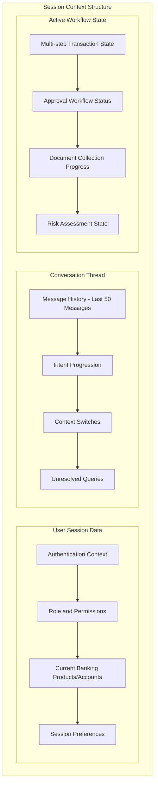
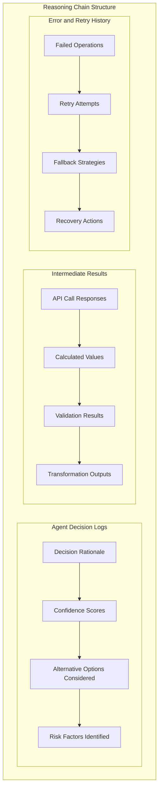
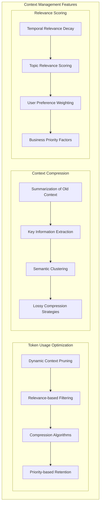

# Memory Systems Architecture - STM & LTM Design

## Overview

The memory systems form the cognitive backbone of the banking agentic layer, providing both immediate session context (STM) and persistent knowledge management (LTM) with enterprise-grade compliance and performance.

## 1. Short-Term Memory (STM) Architecture

### 1.1 STM Components

#### Session Context Store


#### Reasoning Chain Cache


#### Context Window Manager


### 1.2 STM Performance Characteristics
- **Latency**: <10ms for context retrieval
- **Capacity**: 100MB per session (compressed)
- **Retention**: 24 hours or session end
- **Consistency**: Eventually consistent with immediate read-after-write

## 2. Long-Term Memory (LTM) Architecture

### 2.1 LTM Components

#### User Profile Store
```
User Profile Schema:
├── Identity and Demographics
│   ├── Customer ID and identifiers
│   ├── Personal information (PII-protected)
│   ├── Contact preferences
│   └── Accessibility requirements
├── Banking Relationship
│   ├── Account portfolio
│   ├── Product usage patterns
│   ├── Transaction history summary
│   └── Relationship tenure
├── Preferences and Behavior
│   ├── Communication preferences
│   ├── Channel preferences
│   ├── Service preferences
│   └── Risk tolerance
└── Interaction History
    ├── Previous conversations (summarized)
    ├── Issue resolution history
    ├── Satisfaction scores
    └── Escalation patterns
```

#### Knowledge Base
```
Knowledge Base Structure:
├── Banking Domain Knowledge
│   ├── Product information
│   ├── Service procedures
│   ├── Regulatory requirements
│   └── Best practices
├── Regulatory Information
│   ├── Compliance requirements
│   ├── Reporting obligations
│   ├── Risk management guidelines
│   └── Audit procedures
├── Procedural Documentation
│   ├── Standard operating procedures
│   ├── Escalation procedures
│   ├── Emergency protocols
│   └── Training materials
└── Dynamic Knowledge
    ├── Market conditions
    ├── Rate changes
    ├── Policy updates
    └── System status
```

#### Audit and Compliance Store
```
Audit Store Schema:
├── Transaction Logs
│   ├── All system interactions
│   ├── API calls and responses
│   ├── Decision audit trails
│   └── Data access logs
├── Compliance Records
│   ├── Regulatory compliance checks
│   ├── Policy adherence verification
│   ├── Risk assessment results
│   └── Approval workflows
├── Security Events
│   ├── Authentication events
│   ├── Authorization decisions
│   ├── Security violations
│   └── Incident responses
└── Data Lineage
    ├── Data source tracking
    ├── Transformation history
    ├── Quality metrics
    └── Retention compliance
```

#### Analytics Store
```
Analytics Schema:
├── Performance Metrics
│   ├── Agent performance statistics
│   ├── Response time metrics
│   ├── Accuracy measurements
│   └── User satisfaction scores
├── Business Intelligence
│   ├── Usage patterns
│   ├── Popular queries
│   ├── Conversion metrics
│   └── ROI measurements
├── Predictive Analytics
│   ├── User behavior predictions
│   ├── Risk scoring models
│   ├── Churn prediction
│   └── Cross-sell opportunities
└── System Optimization
    ├── Resource utilization
    ├── Bottleneck identification
    ├── Capacity planning
    └── Performance tuning
```

### 2.2 Vector Database Integration
```
Vector DB Components:
├── Semantic Search
│   ├── Document embeddings
│   ├── Query embeddings
│   ├── Similarity search
│   └── Contextual retrieval
├── Knowledge Retrieval
│   ├── RAG (Retrieval Augmented Generation)
│   ├── Semantic clustering
│   ├── Topic modeling
│   └── Knowledge graph integration
└── Personalization
    ├── User preference vectors
    ├── Behavioral embeddings
    ├── Recommendation systems
    └── Content filtering
```

## 3. Memory Bridge & Orchestration

### 3.1 Memory Bridge Architecture
The Memory Bridge serves as the intelligent interface between STM and LTM:

```
Memory Bridge Functions:
├── Context Retrieval Engine
│   ├── Relevance-based LTM queries
│   ├── Semantic search integration
│   ├── Multi-source aggregation
│   └── Context ranking and filtering
├── Memory Synchronization
│   ├── STM to LTM persistence
│   ├── Session summarization
│   ├── Knowledge extraction
│   └── Profile updates
├── Context Compression
│   ├── Intelligent summarization
│   ├── Key information preservation
│   ├── Lossy compression strategies
│   └── Context reconstruction
└── Memory Lifecycle Management
    ├── Automatic cleanup
    ├── Archival strategies
    ├── Retention policy enforcement
    └── Performance optimization
```

### 3.2 Context Retrieval Strategies

#### Hybrid Retrieval Approach
1. **Exact Match**: Direct lookup for specific entities
2. **Semantic Search**: Vector similarity for conceptual matches
3. **Temporal Relevance**: Time-weighted scoring
4. **User Context**: Personalized relevance scoring
5. **Business Rules**: Compliance and policy-driven filtering

#### Retrieval Optimization
```
Optimization Techniques:
├── Caching Strategies
│   ├── Frequently accessed data
│   ├── User-specific caches
│   ├── Session-based caching
│   └── Predictive pre-loading
├── Index Optimization
│   ├── Multi-dimensional indexing
│   ├── Composite indexes
│   ├── Partial indexes
│   └── Covering indexes
└── Query Optimization
    ├── Query plan optimization
    ├── Parallel execution
    ├── Result set limiting
    └── Lazy loading
```

## 4. Banking Compliance Layer

### 4.1 Audit Logging
```
Audit Logging Features:
├── Comprehensive Logging
│   ├── All memory operations
│   ├── Data access patterns
│   ├── Modification history
│   └── User interactions
├── Tamper-Proof Storage
│   ├── Cryptographic hashing
│   ├── Immutable logs
│   ├── Digital signatures
│   └── Blockchain integration
├── Real-Time Monitoring
│   ├── Anomaly detection
│   ├── Compliance violations
│   ├── Security events
│   └── Performance issues
└── Regulatory Reporting
    ├── Automated report generation
    ├── Compliance dashboards
    ├── Audit trail exports
    └── Regulatory submissions
```

### 4.2 PII Masking and Protection
```
PII Protection Mechanisms:
├── Dynamic Masking
│   ├── Role-based masking
│   ├── Context-aware masking
│   ├── Field-level encryption
│   └── Tokenization
├── Data Classification
│   ├── Automatic PII detection
│   ├── Sensitivity scoring
│   ├── Classification tagging
│   └── Handling policies
├── Access Control
│   ├── Attribute-based access
│   ├── Purpose-based access
│   ├── Time-limited access
│   └── Audit trail integration
└── Data Minimization
    ├── Need-to-know basis
    ├── Purpose limitation
    ├── Storage minimization
    └── Retention compliance
```

### 4.3 Data Retention Management
```
Retention Policies:
├── Regulatory Requirements
│   ├── SOX: 7 years for financial records
│   ├── GDPR: Right to be forgotten
│   ├── Basel III: Risk data retention
│   └── Local banking regulations
├── Business Requirements
│   ├── Customer relationship data
│   ├── Analytics and insights
│   ├── Operational efficiency
│   └── Legal protection
├── Technical Implementation
│   ├── Automated archival
│   ├── Secure deletion
│   ├── Data anonymization
│   └── Compliance verification
└── Lifecycle Management
    ├── Creation policies
    ├── Usage monitoring
    ├── Archival triggers
    └── Deletion schedules
```

## 5. Performance and Scalability

### 5.1 Multi-Level Caching
```
Caching Architecture:
├── L1 Cache (Application Memory)
│   ├── Hot data (1-10MB)
│   ├── <1ms access time
│   ├── Session-specific data
│   └── Frequently accessed objects
├── L2 Cache (Redis Cluster)
│   ├── Warm data (100MB-1GB)
│   ├── <5ms access time
│   ├── Shared across sessions
│   └── Computed results
├── L3 Cache (Database Buffer)
│   ├── Cold data (1-10GB)
│   ├── <50ms access time
│   ├── Query result caching
│   └── Index caching
└── CDN Cache (Static Content)
    ├── Documents and media
    ├── <100ms global access
    ├── Regulatory documents
    └── Training materials
```

### 5.2 Database Optimization
```
Database Performance:
├── Partitioning Strategy
│   ├── Temporal partitioning (by date)
│   ├── User-based partitioning
│   ├── Geographic partitioning
│   └── Functional partitioning
├── Indexing Strategy
│   ├── Primary key optimization
│   ├── Composite indexes
│   ├── Partial indexes
│   └── Full-text search indexes
├── Query Optimization
│   ├── Query plan analysis
│   ├── Statistics maintenance
│   ├── Parallel execution
│   └── Connection pooling
└── Replication Strategy
    ├── Master-slave replication
    ├── Read replicas
    ├── Geographic distribution
    └── Failover mechanisms
```

## 6. Security and Access Control

### 6.1 Access Control Matrix
```
Access Control Levels:
├── System Level
│   ├── Infrastructure access
│   ├── Database administration
│   ├── Configuration management
│   └── Monitoring and logging
├── Application Level
│   ├── Feature access
│   ├── Data access
│   ├── Operation permissions
│   └── API access
├── Data Level
│   ├── Record-level security
│   ├── Field-level encryption
│   ├── Attribute-based access
│   └── Dynamic masking
└── User Level
    ├── Role-based permissions
    ├── Contextual access
    ├── Time-based access
    └── Location-based access
```

### 6.2 Encryption Strategy
```
Encryption Implementation:
├── Data at Rest
│   ├── Database encryption (AES-256)
│   ├── File system encryption
│   ├── Backup encryption
│   └── Archive encryption
├── Data in Transit
│   ├── TLS 1.3 for all communications
│   ├── Certificate management
│   ├── Perfect forward secrecy
│   └── Certificate pinning
├── Data in Use
│   ├── Application-level encryption
│   ├── Memory protection
│   ├── Secure enclaves
│   └── Homomorphic encryption
└── Key Management
    ├── Hardware security modules
    ├── Key rotation policies
    ├── Key escrow procedures
    └── Audit trail for key usage
```

## 7. Monitoring and Observability

### 7.1 Memory System Metrics
```
Key Performance Indicators:
├── Performance Metrics
│   ├── Memory access latency
│   ├── Cache hit ratios
│   ├── Query response times
│   └── Throughput measurements
├── Capacity Metrics
│   ├── Memory utilization
│   ├── Storage growth rates
│   ├── Cache efficiency
│   └── Resource consumption
├── Quality Metrics
│   ├── Data accuracy
│   ├── Context relevance
│   ├── Retrieval precision
│   └── User satisfaction
└── Compliance Metrics
    ├── Audit completeness
    ├── Retention compliance
    ├── Access control violations
    └── Data quality scores
```

### 7.2 Alerting and Monitoring
```
Monitoring Framework:
├── Real-Time Monitoring
│   ├── Performance dashboards
│   ├── Health checks
│   ├── Anomaly detection
│   └── Threshold alerting
├── Predictive Monitoring
│   ├── Capacity planning
│   ├── Performance degradation
│   ├── Failure prediction
│   └── Maintenance scheduling
├── Compliance Monitoring
│   ├── Regulatory compliance
│   ├── Policy violations
│   ├── Data quality issues
│   └── Security incidents
└── Business Monitoring
    ├── User experience metrics
    ├── Business KPIs
    ├── ROI measurements
    └── Operational efficiency
```

This memory architecture provides the foundation for intelligent, compliant, and high-performance banking operations while ensuring data security and regulatory compliance.
