# Documentation Index

This directory contains comprehensive documentation for the Enterprise Banking Agentic Layer.

## 📋 Architecture Documentation

### Core Architecture
- [**ARCHITECTURE.md**](ARCHITECTURE.md) - High-level system architecture with layered design and component interactions
- [**MEMORY_ARCHITECTURE.md**](MEMORY_ARCHITECTURE.md) - Detailed STM/LTM design with banking compliance requirements
- [**AGENT_ORCHESTRATION.md**](AGENT_ORCHESTRATION.md) - Multi-agent coordination and specialized banking agents
- [**MCP_FRAMEWORK.md**](MCP_FRAMEWORK.md) - Model Context Protocol integration for banking APIs
- [**SECURITY_COMPLIANCE.md**](SECURITY_COMPLIANCE.md) - Enterprise security layer with banking regulations

### Implementation & Planning
- [**IMPLEMENTATION_PLAN.md**](IMPLEMENTATION_PLAN.md) - 15-month phased implementation strategy with milestones
- [**PROJECT_STRUCTURE.md**](PROJECT_STRUCTURE.md) - Complete modular project organization and file structure
- [**EXECUTIVE_SUMMARY.md**](EXECUTIVE_SUMMARY.md) - Business value proposition and strategic overview

## 🏗️ System Overview

The Enterprise Banking Agentic Layer is designed as a comprehensive solution for banking operations with:

- **Multi-Agent Orchestration**: Intelligent coordination between specialized banking agents
- **Robust Memory Systems**: STM for session context and LTM for persistent knowledge
- **MCP Integration**: Standardized API integration for banking systems
- **Enterprise Security**: Zero-trust architecture with comprehensive compliance
- **Human-in-the-Loop**: Seamless escalation for critical banking scenarios

## 🎯 Key Features

- **350% ROI** over 3 years with comprehensive business case
- **80% process automation** while maintaining human oversight
- **99.9% availability** with enterprise-grade security and compliance
- **Real-time compliance monitoring** for SOX, Basel III, GDPR, PCI DSS
- **Intelligent memory management** with context-aware retrieval

## 📊 Documentation Structure

```mermaid
graph TB
    subgraph "Architecture Docs"
        ARCH[ARCHITECTURE.md]
        MEMORY[MEMORY_ARCHITECTURE.md]
        AGENTS[AGENT_ORCHESTRATION.md]
        MCP[MCP_FRAMEWORK.md]
        SECURITY[SECURITY_COMPLIANCE.md]
    end

    subgraph "Implementation Docs"
        PLAN[IMPLEMENTATION_PLAN.md]
        STRUCTURE[PROJECT_STRUCTURE.md]
        SUMMARY[EXECUTIVE_SUMMARY.md]
    end

    ARCH --> MEMORY
    MEMORY --> AGENTS
    AGENTS --> MCP
    MCP --> SECURITY
    PLAN --> STRUCTURE
    STRUCTURE --> SUMMARY
```

## 🚀 Getting Started

1. Start with [**EXECUTIVE_SUMMARY.md**](EXECUTIVE_SUMMARY.md) for business overview
2. Review [**ARCHITECTURE.md**](ARCHITECTURE.md) for technical architecture
3. Examine [**IMPLEMENTATION_PLAN.md**](IMPLEMENTATION_PLAN.md) for development roadmap
4. Explore specific components based on your role and interests

## 🔗 Quick Navigation

| Role | Recommended Reading |
|------|-------------------|
| **Executive/Business** | [Executive Summary](EXECUTIVE_SUMMARY.md) → [Implementation Plan](IMPLEMENTATION_PLAN.md) |
| **Architect/Technical Lead** | [Architecture](ARCHITECTURE.md) → [Memory Architecture](MEMORY_ARCHITECTURE.md) → [Agent Orchestration](AGENT_ORCHESTRATION.md) |
| **Security/Compliance** | [Security & Compliance](SECURITY_COMPLIANCE.md) → [Architecture](ARCHITECTURE.md) |
| **Developer** | [Project Structure](PROJECT_STRUCTURE.md) → [Implementation Plan](IMPLEMENTATION_PLAN.md) → [MCP Framework](MCP_FRAMEWORK.md) |
| **DevOps/Infrastructure** | [Implementation Plan](IMPLEMENTATION_PLAN.md) → [Project Structure](PROJECT_STRUCTURE.md) → [Architecture](ARCHITECTURE.md) |

---

**Enterprise Banking** | **Secure by Design** | **Compliant by Default**
