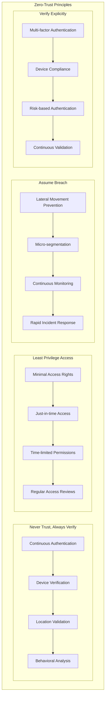

# Security & Compliance Architecture

## Overview

The Security & Compliance Architecture provides comprehensive protection for the banking agentic layer, ensuring adherence to financial regulations, data protection laws, and industry best practices. This architecture implements defense-in-depth strategies with multiple security layers and continuous compliance monitoring.

## 1. Security Architecture Layers

### 1.1 Defense-in-Depth Model


### 1.2 Zero-Trust Architecture



## 2. Authentication & Authorization

### 2.1 Multi-Factor Authentication (MFA)

```
MFA Components:
├── Something You Know (Knowledge)
│   ├── Passwords
│   ├── PINs
│   ├── Security questions
│   └── Passphrases
├── Something You Have (Possession)
│   ├── Hardware tokens
│   ├── Smart cards
│   ├── Mobile devices
│   └── SMS/Email codes
├── Something You Are (Inherence)
│   ├── Fingerprint scanning
│   ├── Facial recognition
│   ├── Voice recognition
│   └── Retinal scanning
└── Adaptive Authentication
    ├── Risk-based authentication
    ├── Behavioral biometrics
    ├── Device fingerprinting
    └── Geolocation analysis
```

### 2.2 Role-Based Access Control (RBAC)

```
RBAC Hierarchy:
├── Banking Roles
│   ├── Customer Service Representative
│   │   ├── View customer profiles
│   │   ├── Process basic transactions
│   │   ├── Update contact information
│   │   └── Escalate complex issues
│   ├── Loan Officer
│   │   ├── Process loan applications
│   │   ├── Perform credit assessments
│   │   ├── Approve small loans
│   │   └── Generate loan reports
│   ├── Risk Analyst
│   │   ├── Perform risk assessments
│   │   ├── Generate risk reports
│   │   ├── Monitor risk metrics
│   │   └── Escalate high-risk situations
│   ├── Compliance Officer
│   │   ├── Monitor regulatory compliance
│   │   ├── Generate compliance reports
│   │   ├── Investigate violations
│   │   └── Implement corrective actions
│   ├── Branch Manager
│   │   ├── Approve medium-value transactions
│   │   ├── Override system decisions
│   │   ├── Access branch analytics
│   │   └── Manage staff permissions
│   └── Executive
│       ├── Access all system functions
│       ├── Approve high-value transactions
│       ├── View executive dashboards
│       └── Configure system policies
├── Technical Roles
│   ├── System Administrator
│   ├── Database Administrator
│   ├── Security Administrator
│   └── Audit Administrator
└── External Roles
    ├── External Auditor
    ├── Regulatory Inspector
    ├── Third-party Vendor
    └── Customer
```

### 2.3 Attribute-Based Access Control (ABAC)

```
ABAC Attributes:
├── Subject Attributes
│   ├── User identity
│   ├── Role assignments
│   ├── Department/division
│   ├── Security clearance
│   ├── Employment status
│   └── Training certifications
├── Resource Attributes
│   ├── Data classification
│   ├── Sensitivity level
│   ├── Owner information
│   ├── Creation date
│   ├── Retention period
│   └── Geographic location
├── Action Attributes
│   ├── Operation type (read/write/delete)
│   ├── Access method
│   ├── Urgency level
│   └── Business purpose
├── Environment Attributes
│   ├── Time of access
│   ├── Location/IP address
│   ├── Device type
│   ├── Network security level
│   ├── Risk score
│   └── Compliance status
└── Dynamic Attributes
    ├── Current workload
    ├── System health
    ├── Threat level
    └── Regulatory status
```

## 3. Data Protection & Encryption

### 3.1 Data Classification

```
Data Classification Levels:
├── Public
│   ├── Marketing materials
│   ├── Published reports
│   ├── General product information
│   └── Public announcements
├── Internal
│   ├── Internal policies
│   ├── Operational procedures
│   ├── Training materials
│   └── Internal communications
├── Confidential
│   ├── Customer data
│   ├── Financial records
│   ├── Business strategies
│   └── Vendor contracts
├── Restricted
│   ├── Personal identifiable information (PII)
│   ├── Payment card information (PCI)
│   ├── Credit information
│   └── Account details
└── Top Secret
    ├── Regulatory investigation data
    ├── Merger and acquisition information
    ├── Executive compensation
    └── Legal proceedings
```

### 3.2 Encryption Strategy

```
Encryption Implementation:
├── Data at Rest
│   ├── Database Encryption
│   │   ├── Transparent Data Encryption (TDE)
│   │   ├── Column-level encryption
│   │   ├── Application-level encryption
│   │   └── Key management integration
│   ├── File System Encryption
│   │   ├── Full disk encryption
│   │   ├── File-level encryption
│   │   ├── Folder encryption
│   │   └── Backup encryption
│   └── Cloud Storage Encryption
│       ├── Server-side encryption
│       ├── Client-side encryption
│       ├── Envelope encryption
│       └── Key management service
├── Data in Transit
│   ├── Network Encryption
│   │   ├── TLS 1.3 for HTTPS
│   │   ├── IPSec for VPN
│   │   ├── SSH for secure shell
│   │   └── SFTP for file transfer
│   ├── API Encryption
│   │   ├── OAuth 2.0 with PKCE
│   │   ├── JWT token encryption
│   │   ├── Message-level encryption
│   │   └── End-to-end encryption
│   └── Internal Communication
│       ├── Service mesh encryption
│       ├── Message queue encryption
│       ├── Database connection encryption
│       └── Cache encryption
├── Data in Use
│   ├── Application-Level Encryption
│   │   ├── Field-level encryption
│   │   ├── Format-preserving encryption
│   │   ├── Searchable encryption
│   │   └── Homomorphic encryption
│   ├── Memory Protection
│   │   ├── Secure memory allocation
│   │   ├── Memory encryption
│   │   ├── Memory wiping
│   │   └── Buffer overflow protection
│   └── Processing Encryption
│       ├── Secure enclaves
│       ├── Trusted execution environments
│       ├── Confidential computing
│       └── Hardware security modules
└── Key Management
    ├── Key Generation
    │   ├── Hardware random number generators
    │   ├── Cryptographically secure algorithms
    │   ├── Key derivation functions
    │   └── Entropy sources
    ├── Key Storage
    │   ├── Hardware security modules (HSM)
    │   ├── Key management services
    │   ├── Secure key vaults
    │   └── Distributed key storage
    ├── Key Rotation
    │   ├── Automated key rotation
    │   ├── Key versioning
    │   ├── Backward compatibility
    │   └── Emergency key rotation
    └── Key Recovery
        ├── Key escrow procedures
        ├── Split knowledge
        ├── Dual control
        └── Audit trails
```

### 3.3 PII Protection & Masking

```
PII Protection Mechanisms:
├── Data Discovery
│   ├── Automated PII scanning
│   ├── Pattern recognition
│   ├── Machine learning classification
│   └── Regular expression matching
├── Data Masking
│   ├── Static Data Masking
│   │   ├── Substitution masking
│   │   ├── Shuffling masking
│   │   ├── Number variance masking
│   │   └── Encryption masking
│   ├── Dynamic Data Masking
│   │   ├── Real-time masking
│   │   ├── Role-based masking
│   │   ├── Context-aware masking
│   │   └── Conditional masking
│   └── Format-Preserving Encryption
│       ├── Maintains data format
│       ├── Preserves data relationships
│       ├── Enables analytics
│       └── Supports referential integrity
├── Tokenization
│   ├── Format-preserving tokens
│   ├── Random tokens
│   ├── Deterministic tokens
│   └── Vault-based tokenization
└── Data Anonymization
    ├── K-anonymity
    ├── L-diversity
    ├── T-closeness
    └── Differential privacy
```

## 4. Regulatory Compliance

### 4.1 Financial Regulations

```
Banking Regulations:
├── Sarbanes-Oxley Act (SOX)
│   ├── Financial reporting controls
│   ├── Internal control assessment
│   ├── Audit trail requirements
│   ├── Executive certification
│   └── Whistleblower protection
├── Basel III
│   ├── Capital adequacy requirements
│   ├── Risk management framework
│   ├── Liquidity requirements
│   ├── Leverage ratio requirements
│   └── Stress testing
├── Dodd-Frank Act
│   ├── Volcker Rule compliance
│   ├── Systemically important financial institutions
│   ├── Consumer protection
│   ├── Derivatives regulation
│   └── Risk retention requirements
├── Anti-Money Laundering (AML)
│   ├── Customer due diligence
│   ├── Suspicious activity reporting
│   ├── Currency transaction reporting
│   ├── Beneficial ownership identification
│   └── Sanctions screening
└── Know Your Customer (KYC)
    ├── Customer identification program
    ├── Customer due diligence
    ├── Enhanced due diligence
    ├── Ongoing monitoring
    └── Record keeping requirements
```

### 4.2 Data Protection Regulations

```
Data Protection Laws:
├── General Data Protection Regulation (GDPR)
│   ├── Lawful basis for processing
│   ├── Data subject rights
│   ├── Privacy by design
│   ├── Data protection impact assessments
│   ├── Breach notification requirements
│   └── Data protection officer appointment
├── California Consumer Privacy Act (CCPA)
│   ├── Consumer rights to know
│   ├── Right to delete personal information
│   ├── Right to opt-out of sale
│   ├── Non-discrimination provisions
│   └── Service provider obligations
├── Payment Card Industry Data Security Standard (PCI DSS)
│   ├── Build and maintain secure networks
│   ├── Protect cardholder data
│   ├── Maintain vulnerability management
│   ├── Implement strong access control
│   ├── Regularly monitor and test networks
│   └── Maintain information security policy
└── Health Insurance Portability and Accountability Act (HIPAA)
    ├── Privacy rule
    ├── Security rule
    ├── Breach notification rule
    ├── Enforcement rule
    └── Omnibus rule
```

### 4.3 Compliance Monitoring

```
Compliance Monitoring Framework:
├── Automated Compliance Checking
│   ├── Real-time policy enforcement
│   ├── Continuous compliance monitoring
│   ├── Automated violation detection
│   └── Compliance scoring
├── Risk Assessment
│   ├── Compliance risk identification
│   ├── Risk impact analysis
│   ├── Risk mitigation strategies
│   └── Residual risk monitoring
├── Audit Trail Management
│   ├── Comprehensive logging
│   ├── Immutable audit logs
│   ├── Log integrity verification
│   └── Audit trail analysis
├── Reporting and Documentation
│   ├── Regulatory reporting
│   ├── Compliance dashboards
│   ├── Exception reporting
│   └── Management reporting
└── Remediation Management
    ├── Violation tracking
    ├── Corrective action plans
    ├── Remediation monitoring
    └── Effectiveness validation
```

## 5. Audit & Logging

### 5.1 Comprehensive Audit Framework

```
Audit Logging Components:
├── System Audit Logs
│   ├── Authentication events
│   ├── Authorization decisions
│   ├── System configuration changes
│   ├── Administrative actions
│   └── Security events
├── Application Audit Logs
│   ├── User actions
│   ├── Business transactions
│   ├── Data access events
│   ├── Agent decisions
│   └── Workflow executions
├── Data Audit Logs
│   ├── Data creation events
│   ├── Data modification events
│   ├── Data deletion events
│   ├── Data access events
│   └── Data export events
├── Security Audit Logs
│   ├── Security policy violations
│   ├── Intrusion attempts
│   ├── Malware detection
│   ├── Vulnerability scans
│   └── Incident response actions
└── Compliance Audit Logs
    ├── Regulatory compliance checks
    ├── Policy compliance verification
    ├── Audit findings
    ├── Remediation actions
    └── Certification activities
```

### 5.2 Log Management

```
Log Management Features:
├── Log Collection
│   ├── Centralized log aggregation
│   ├── Real-time log streaming
│   ├── Log parsing and normalization
│   └── Log enrichment
├── Log Storage
│   ├── Secure log storage
│   ├── Log compression
│   ├── Long-term archival
│   └── Geographic distribution
├── Log Analysis
│   ├── Real-time analysis
│   ├── Historical analysis
│   ├── Correlation analysis
│   └── Anomaly detection
├── Log Retention
│   ├── Retention policy enforcement
│   ├── Automated archival
│   ├── Secure deletion
│   └── Legal hold management
└── Log Integrity
    ├── Digital signatures
    ├── Hash verification
    ├── Tamper detection
    └── Chain of custody
```

## 6. Incident Response & Security Operations

### 6.1 Security Operations Center (SOC)

```
SOC Components:
├── Threat Detection
│   ├── Security information and event management (SIEM)
│   ├── Intrusion detection systems (IDS)
│   ├── Endpoint detection and response (EDR)
│   ├── Network traffic analysis
│   └── Threat intelligence feeds
├── Incident Response
│   ├── Incident classification
│   ├── Response procedures
│   ├── Escalation protocols
│   ├── Communication plans
│   └── Recovery procedures
├── Threat Hunting
│   ├── Proactive threat hunting
│   ├── Behavioral analysis
│   ├── Indicator of compromise (IoC) analysis
│   ├── Threat landscape monitoring
│   └── Attribution analysis
├── Vulnerability Management
│   ├── Vulnerability scanning
│   ├── Risk assessment
│   ├── Patch management
│   ├── Configuration management
│   └── Penetration testing
└── Security Orchestration
    ├── Automated response
    ├── Playbook execution
    ├── Workflow automation
    ├── Integration management
    └── Metrics and reporting
```

### 6.2 Incident Response Plan

```
Incident Response Phases:
├── Preparation
│   ├── Incident response team formation
│   ├── Response procedures documentation
│   ├── Tool and resource preparation
│   ├── Training and awareness
│   └── Communication plan development
├── Identification
│   ├── Incident detection
│   ├── Initial assessment
│   ├── Incident classification
│   ├── Severity determination
│   └── Stakeholder notification
├── Containment
│   ├── Short-term containment
│   ├── Long-term containment
│   ├── Evidence preservation
│   ├── System isolation
│   └── Damage assessment
├── Eradication
│   ├── Root cause analysis
│   ├── Threat removal
│   ├── Vulnerability remediation
│   ├── System hardening
│   └── Security control improvement
├── Recovery
│   ├── System restoration
│   ├── Service resumption
│   ├── Monitoring enhancement
│   ├── Validation testing
│   └── Business continuity
└── Lessons Learned
    ├── Post-incident review
    ├── Process improvement
    ├── Documentation updates
    ├── Training updates
    └── Metrics analysis
```

## 7. Security Monitoring & Analytics

### 7.1 Security Metrics

```
Security KPIs:
├── Preventive Metrics
│   ├── Security control effectiveness
│   ├── Vulnerability remediation time
│   ├── Patch deployment rate
│   ├── Security training completion
│   └── Compliance score
├── Detective Metrics
│   ├── Mean time to detection (MTTD)
│   ├── False positive rate
│   ├── Alert volume
│   ├── Threat detection accuracy
│   └── Security event correlation
├── Responsive Metrics
│   ├── Mean time to response (MTTR)
│   ├── Incident resolution time
│   ├── Recovery time objective (RTO)
│   ├── Recovery point objective (RPO)
│   └── Business impact duration
├── Risk Metrics
│   ├── Risk exposure level
│   ├── Risk mitigation effectiveness
│   ├── Residual risk level
│   ├── Risk trend analysis
│   └── Risk appetite alignment
└── Compliance Metrics
    ├── Regulatory compliance score
    ├── Policy compliance rate
    ├── Audit finding resolution
    ├── Control effectiveness
    └── Certification status
```

### 7.2 Threat Intelligence

```
Threat Intelligence Framework:
├── Intelligence Collection
│   ├── Open source intelligence (OSINT)
│   ├── Commercial threat feeds
│   ├── Government intelligence
│   ├── Industry sharing
│   └── Internal intelligence
├── Intelligence Analysis
│   ├── Indicator analysis
│   ├── Tactics, techniques, and procedures (TTP) analysis
│   ├── Attribution analysis
│   ├── Campaign analysis
│   └── Trend analysis
├── Intelligence Dissemination
│   ├── Threat briefings
│   ├── Intelligence reports
│   ├── Alert notifications
│   ├── Dashboard updates
│   └── API integration
├── Intelligence Application
│   ├── Preventive controls
│   ├── Detective controls
│   ├── Response procedures
│   ├── Hunt activities
│   └── Risk assessments
└── Intelligence Feedback
    ├── Effectiveness measurement
    ├── Quality assessment
    ├── Source evaluation
    ├── Process improvement
    └── Requirements refinement
```

This comprehensive security and compliance architecture ensures that the banking agentic layer meets the highest standards of security, privacy, and regulatory compliance while maintaining operational efficiency and user experience.
